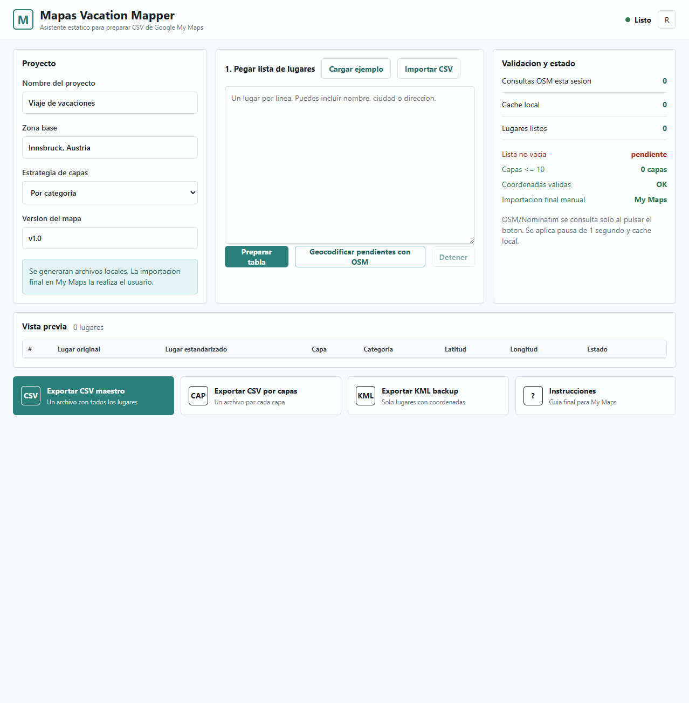
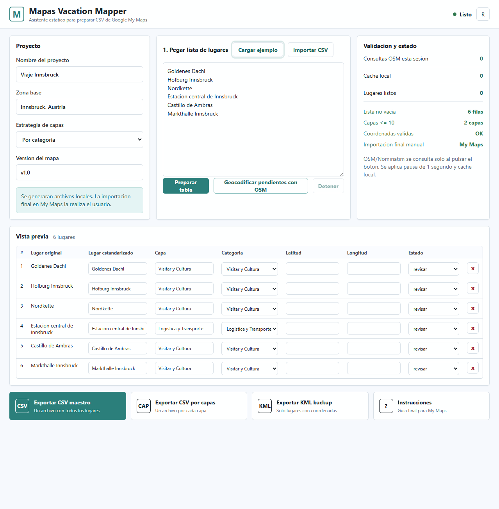
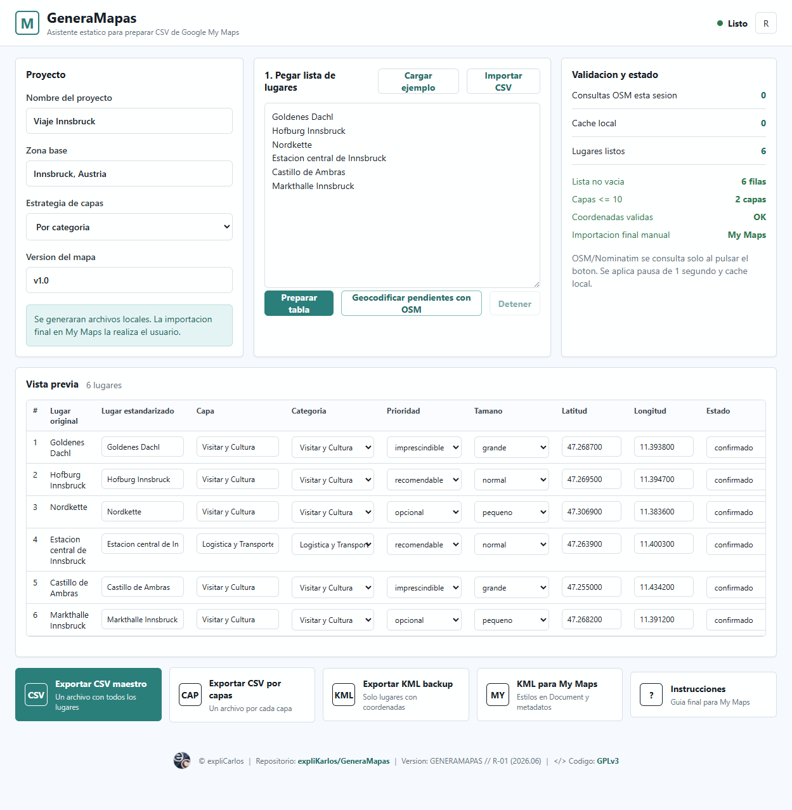

# Guia de usuario: preparar un mapa para Google My Maps

Esta guia explica como usar la app `GeneraMapas` sin conocimientos tecnicos.

La app ayuda a preparar los archivos que luego se importan manualmente en Google My Maps.

## Que necesitas

- Un navegador web.
- Una lista de lugares.
- Una cuenta de Google para crear el mapa final en Google My Maps.

No necesitas instalar programas si usas la version publicada en GitHub Pages.

## Que genera la app

- CSV maestro: archivo principal con todos los lugares.
- CSV por capas: un archivo separado por cada capa.
- KML backup: copia opcional para Google Earth o respaldo.
- KML para My Maps: archivo KML con estilos por categoria y metadatos.
- Instrucciones: guia personalizada para importar en My Maps.

## Paso 1: abrir la app

Abre la app en el navegador.

Si la estas probando localmente:

```powershell
python -m http.server 8080 -d .\Mapas\github-pages
```

Luego abre:

```text
http://localhost:8080
```

Pantalla inicial:



## Paso 2: completar los datos del proyecto

En el panel `Proyecto`, revisa:

- Nombre del proyecto.
- Zona base.
- Estrategia de capas.
- Version del mapa.

Recomendacion:

- Para viajes: usa capas por dia o por categoria.
- Para guias generales: usa capas por categoria.

## Paso 3: pegar o importar lugares

Tienes dos opciones:

- Pegar una lista de lugares, uno por linea.
- Importar un CSV existente con el boton `Importar CSV`.

Ejemplo de lista:

```text
Goldenes Dachl
Hofburg Innsbruck
Nordkette
Estacion central de Innsbruck
Castillo de Ambras
Markthalle Innsbruck
```

Pulsa `Preparar tabla`.

Tambien puedes pulsar `Cargar ejemplo` para ver como funciona.

Ejemplo cargado:



## Paso 4: revisar la tabla

La tabla permite editar:

- Lugar estandarizado.
- Capa.
- Categoria.
- Latitud.
- Longitud.
- Estado.

Estados:

- `confirmado`: listo para importar.
- `revisar`: necesita comprobacion.
- `por_confirmar`: no debe tratarse como definitivo.

Puedes eliminar una fila con el boton `x`.

## Paso 5: geocodificar con OpenStreetMap

Pulsa `Geocodificar pendientes con OSM` solo cuando quieras buscar coordenadas.

La app:

- consulta Nominatim/OpenStreetMap,
- hace una pausa aproximada de 1 segundo entre consultas,
- guarda resultados en cache local del navegador,
- no geocodifica mientras escribes.

Importante:

- Revisa los resultados, especialmente si hay nombres ambiguos.
- Si una ubicacion no es clara, dejala como `revisar` o `por_confirmar`.
- No uses esta funcion como buscador continuo.

Estado listo para exportar:



## Paso 6: exportar archivos

Usa los botones inferiores:

- `Exportar CSV maestro`: recomendado para mantener el proyecto.
- `Exportar CSV por capas`: util si quieres importar cada capa por separado.
- `Exportar KML backup`: opcional, pensado para respaldo o Google Earth.
- `KML para My Maps`: KML con estilos definidos en `Document`, sin carpetas y con metadatos en `ExtendedData`.
- `Instrucciones`: genera una guia de importacion para tu mapa.

## Paso 7: importar en Google My Maps

En Google My Maps:

1. Crea un mapa nuevo.
2. Crea o selecciona una capa.
3. Pulsa `Importar`.
4. Sube el CSV.
5. Elige `latitude` y `longitude` como columnas de ubicacion.
6. Elige `nombre_visible` como titulo del marcador.
7. Estila por la columna `categoria`.

Para actualizar un mapa existente:

- Usa `Update matching items`.
- Usa `id_lugar` como columna de coincidencia.
- Evita `Replace all items` salvo que quieras reconstruir la capa completa.

## Buenas practicas

- Conserva siempre el CSV maestro.
- No importes CSV y KML completos en el mismo mapa operativo.
- Revisa manualmente los lugares ambiguos.
- Manten una version clara del mapa, por ejemplo: `Viaje Innsbruck v1.0 2026-06-28`.
- Usa el CSV como fuente principal de mantenimiento.
- Usa el KML para My Maps solo cuando prefieras importar marcadores con estilos/metadatos desde KML.

## Problemas frecuentes

### La app no encuentra un lugar

Prueba a escribir el lugar con mas contexto:

```text
Goldenes Dachl, Innsbruck, Austria
```

### Hay varios lugares con el mismo nombre

Revisa la direccion y deja el estado como `revisar` hasta confirmar.

### My Maps no muestra imagenes dentro del marcador

Usa enlaces a imagenes o la funcion nativa de fotos de My Maps. No dependas de imagenes embebidas.

### Quiero actualizar sin perder estilos

Reimporta usando `Update matching items` y la columna `id_lugar`.
